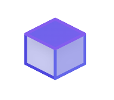

 # [ProductKit](https://productkit.liftgate.io)


An agentic platform to automatically generate product listings for user-facing pages, Shopify integrations, and FAQ/documentation.

## Description
ProductKit is an intuitive, all-in-one toolkit for product designers, small businesses, and others to easily set up and maintain their storefront.

The configuration of a typical storefront (Shopify, in this case) could take up to multiple weeks. We automate the following:
- Product documentation generation
- Product image showcase in multiple scenes, with a consistent background and 4K quality
- Product video showcase
- Product interactive 3D model showcase
- Auto sync/propagation to your Shopify storefront

We do this with the following pipeline:
- Image Gen:
  - image name, description, and content are fed into Anthropic's Claude Sonnet 4.5 to get a textual representation of the image and generate N number of dynamically generated prompts for the new showcase images. Showcase images are sent (prompt + img) to FLUX.2.
- Veo2 on fal.ai is used to generate a showcase video based on the original images submitted along with the product.
- omnipart on fal.ai is used to stitch together and generate a 3d model (.glb) and visualize it on the website using ThreeJS
- MongoDB is used as the backing store, DigitalOcean is used for deployment and blob storage, Vercel's NextJS is used for the frontend from the ground up, Kotlin is used for the backend.

## Tech Stack
BFL (FLUX.2), fal.ai (media model APIs), Anthropic (Claude Sonnet 4.5 via. API for text gen.), NVIDIA (codegen and documentation in the codebase via. NIM), Vercel (next.js codebase for the frontend), DigitalOcean (deployment & S3/Spaces for object storage)

# Getting Started

## Public Instance
Visit our public instance: [ProductKit](https://productkit.liftgate.io)

## Local
- run `bun install` in `frontend`
- configure your frontend API server in a `.env` file in the `frontend` dir
```properties
NEXT_PUBLIC_API_URL=https://prod-api-pkit.liftgate.io
NEXT_PUBLIC_WS_URL=wss://prod-api-pkit.liftgate.io
```
- if running fully local, ensure you have a mongodb instance running locally
- start the ktor backend in `backend` with the following `.env`
```properties
# fal.ai
FAL_KEY=my:key

# DigitalOcean Spaces
DO_SPACES_KEY=MYKEY
DO_SPACES_SECRET=my/secret
DO_SPACES_BUCKET=productkit
DO_SPACES_ENDPOINT=https://sfo3.digitaloceanspaces.com

# Anthropic API
ANTHROPIC_API_KEY=sk-ant-api03-my-key
```
